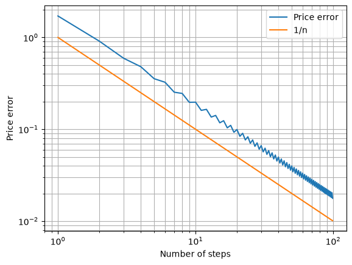

# Binomial Option Pricing (Cox–Ross–Rubinstein)

Victor Miller · [GitHub](https://github.com/victor-mler) · [LinkedIn](https://www.linkedin.com/in/miller-victor)

An implementation of the Cox-Ross-Rubinstein binomial tree for European and American options.

## Table of Contents

- [Key results](#key-results)
- [How it works](#how-it-works)
- [What is inside](#what-is-inside)
- [Getting started](#getting-started)
- [Repository structure](#repository-structure)
- [License](#license)

## Key results

All checks use $S_0 = 100$, $K = 100$, $T = 1$, $\sigma = 20\%$, $r = 5\%$, and $n = 5000$ steps.

| Check | Tree | Reference |
|---|---|---|
| European call | 10.4502 | Black-Scholes: 10.4506 |
| Call minus put | 4.8771 | $S_0 - Ke^{-rT}$: 4.8771 |
| Call hedge ratio | 0.6368 | $N(d_1)$: 0.6368 |
| American put | 6.0902 | European put: 5.5731 |

The tree price converges to Black-Scholes as $n$ grows; the error decays like $1/n$.



## How it works

The stock moves up by $u = e^{\sigma\sqrt{\Delta t}}$ or down by $d = 1/u$. The up probability

$$p = \frac{e^{r\Delta t} - d}{u - d}$$

is chosen so the stock earns the risk-free rate on average. The option is priced backwards from its payoff, discounting at $r$ each step. American options add one check per node: the value is the maximum of keeping the option and exercising it.

## What is inside

1. European options: `european_option_binomial_model` prices a call or a put with the CRR tree and returns the price plus the hedge ratio $\Delta = (C_u - C_d) / (S_0 (u - d))$.
2. American options: `american_option_binomial_model` adds the early-exercise check at each node: keep the option or exercise it, whichever is worth more.
3. Put-call parity: a call and a put at the same strike and maturity must satisfy $C - P = S_0 - Ke^{-rT}$; the tree reproduces it exactly.
4. Black-Scholes reference: `black_scholes_option_pricer` gives the closed-form price and hedge ratio used as benchmark.
5. Convergence: the figure above plots the tree error against the $1/n$ reference slope.

## Getting started

```
pip install -r requirements.txt
```

Open `binomial_model.ipynb` and run all cells.

## Repository structure

```
binomial_model/
├── binomial_model.ipynb   # model, validation, figures
├── README.md
├── requirements.txt
├── LICENSE.txt
├── .gitignore
└── figures/
    └── convergence.png
```

## License

[MIT](LICENSE.txt)